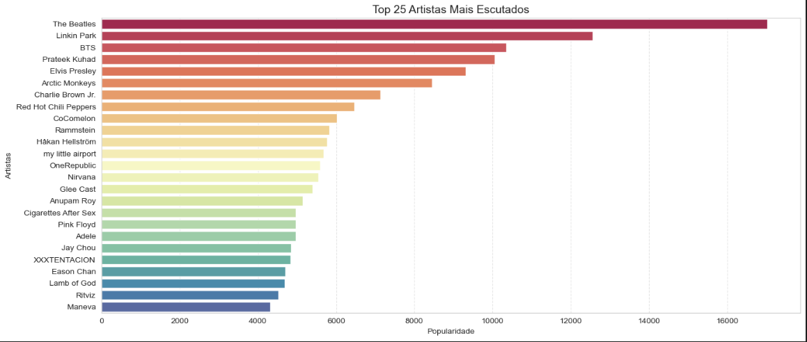
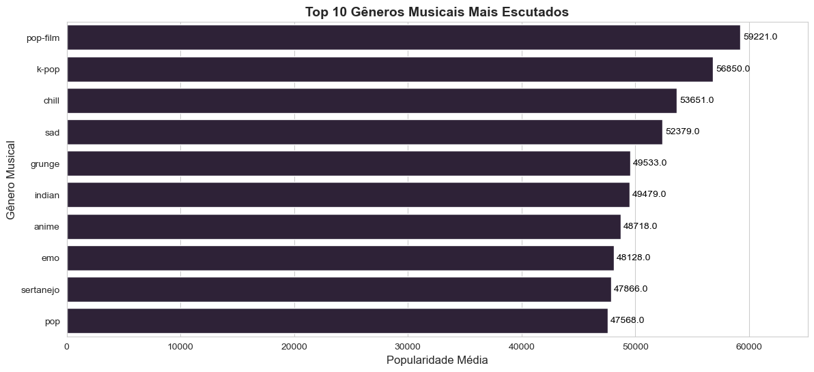
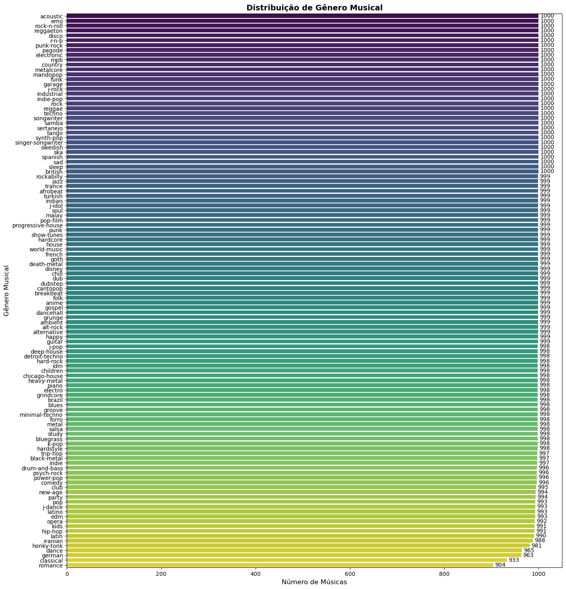
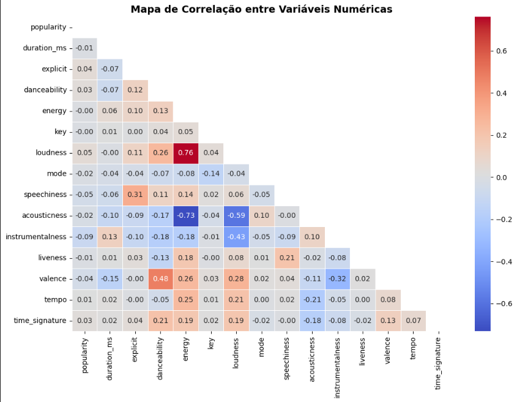
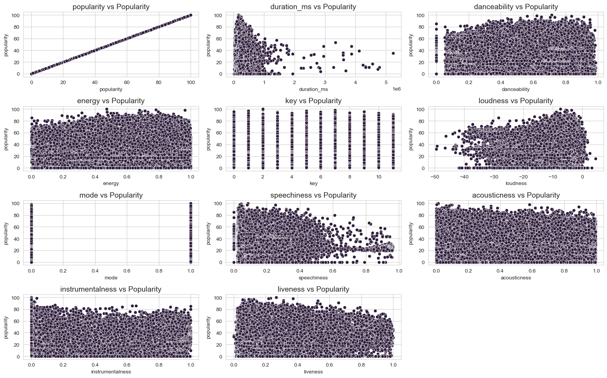
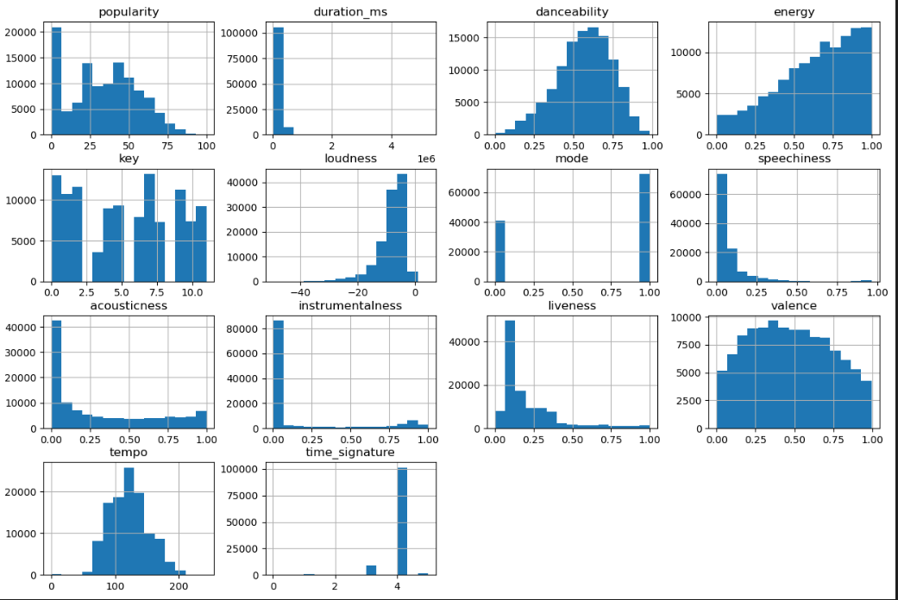

# Análise de Dados Python: 114000 Spotify Songs

Neste estudo, foi realizado uma análise da base de dados **"114000 Spotify Songs"**, que contém uma vasta coleção de músicas disponíveis na plataforma. O objetivo é explorar as diferentes categorias de músicas e obter insights valiosos a partir desses dados. Para isso, vamos responder a algumas perguntas importantes de negócio.

## Perguntas de Negócio

### Quais gêneros musicais são mais populares?

Analisaremos a popularidade dos diferentes gêneros musicais para entender quais são mais apreciados pelo público. Essa informação pode ajudar a definir prioridades em futuras produções ou aquisições, permitindo uma melhor alocação de recursos para maximizar o sucesso.

### Quais características musicais têm alguma correlação com popularidade?

Investigaremos quais atributos das músicas, como *danceability*, *energy*, *acousticness*, entre outros, têm uma relação com a popularidade. Isso nos ajudará a identificar padrões que possam influenciar o sucesso de uma música.

### Quais artistas têm as músicas mais populares?

Identificaremos os artistas cujas músicas têm maior popularidade, explorando quais estratégias, como colaborações, podem ser utilizadas para aumentar ainda mais a visibilidade e o alcance das músicas.

Essa análise será realizada utilizando ferramentas de análise de dados em Python, como *Pandas*, *Seaborn* e *Matplotlib*. Através de gráficos e estatísticas, vamos interpretar os dados e fornecer recomendações acionáveis para a indústria musical.

## Dataset

O dataset está disponível em: [114000 Spotify Songs - Kaggle](https://www.kaggle.com/datasets/priyamchoksi/spotify-dataset-114k-songs)

------------

# Insights

# Conclusão da Análise de Dados

A análise dos dados da base **"114000 Spotify Songs"** proporcionou uma visão abrangente das tendências de popularidade e das características musicais. Observamos que a distribuição da popularidade é desigual, com poucas músicas alcançando altos níveis de popularidade enquanto a maioria permanece com uma audiência mais modesta. As características musicais, como **Danceability**, **Energy** e **Loudness**, são predominantes, sugerindo uma preferência por músicas enérgicas e dançantes. Em contrapartida, faixas **acústicas**, **instrumentais** e **gravadas ao vivo** são menos comuns.

Apesar de algumas suposições iniciais, **não encontramos correlações significativas entre Popularidade e outras variáveis**, indicando que a popularidade de uma música pode depender de uma mistura complexa de fatores que vão além das características musicais mensuráveis. Isso ressalta a importância de considerar elementos como **marketing**, **tendências culturais** e **preferências pessoais**, que também desempenham um papel crucial no sucesso de uma faixa.

## Diversidade de Gêneros e Artistas

A diversidade de gêneros e artistas populares revela uma ampla gama de preferências entre os ouvintes, com artistas de diferentes estilos e origens culturais alcançando grande popularidade. A presença contínua de artistas clássicos como **The Beatles** e **Elvis Presley**, juntamente com o impacto de fenômenos modernos como **BTS** e conteúdos infantis como **CoComelon**, demonstra a pluralidade do mercado musical atual. Além disso, a popularidade de artistas regionais, como **Prateek Kuhad** e **Charlie Brown Jr.**, evidencia o crescente papel das plataformas de streaming em permitir o acesso global a músicas de nicho e regionais.

## A Complexidade da Popularidade Musical

A popularidade musical é um fenômeno multifacetado que **não pode ser completamente explicado por características musicais isoladas**. A análise sugere que uma combinação de **fatores culturais**, **emocionais** e de **marketing**, aliada à diversidade de ofertas musicais, contribui para o sucesso de uma música ou artista. Isso destaca a complexidade do mercado musical e a importância de uma abordagem abrangente ao analisar e entender as tendências de consumo musical.

